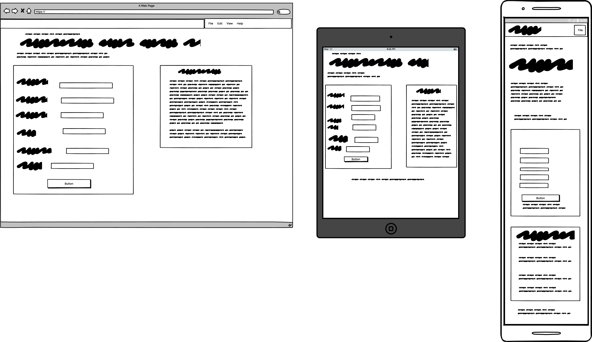
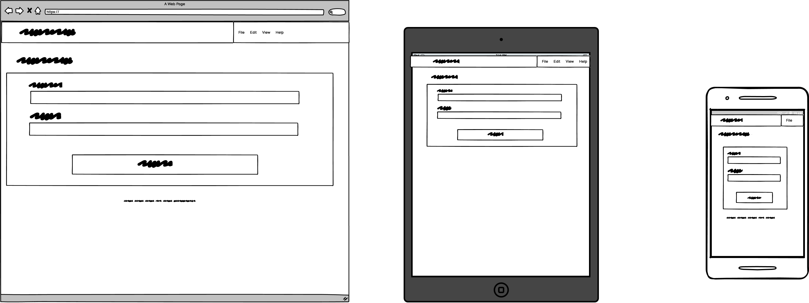
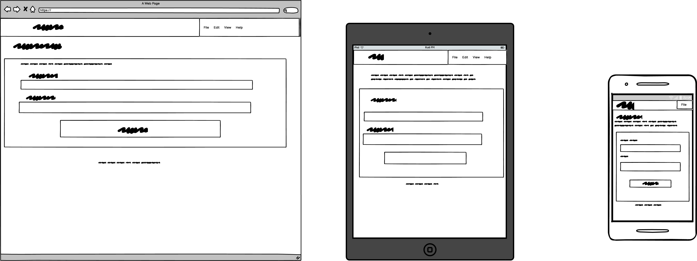

# Café Central


Café Central is a full-stack restaurant booking platform built with Django and Python where users can book tables online without calling the restaurant. The application features date/time-based bookings, table capacity management, edit/cancel flows via booking codes, and secure staff/admin access.

## Live Project

`https://project-three-restaurant-booking.onrender.com/`

---

## Contents

- [Project Rationale](#project-rationale)  
- [Project Goals](#project-goals)  
  - [User Goals](#user-goals)  
  - [Site Owner Goals](#site-owner-goals)  
  - [Development Goals](#development-goals)  
- [User Experience (UX)](#user-experience-ux)  
  - [Target Audience](#target-audience)  
  - [User Stories](#user-stories)  
  - [Design](#design)  
    - [Wireframes](#wireframes)  
    - [Color Scheme](#color-scheme)  
    - [Typography](#typography)  
    - [UX Design Principles](#ux-design-principles)  
- [Features](#features)  
  - [Existing Features](#existing-features)  
  - [Future Enhancements](#future-enhancements)  
- [Database Design](#database-design)  
  - [Data Schema](#data-schema)  
  - [Entity Relationship Diagram](#entity-relationship-diagram)  
  - [Data Models](#data-models)  
- [Technologies Used](#technologies-used)  
  - [Languages](#languages)  
  - [Frameworks and Libraries](#frameworks-and-libraries)  
  - [Database](#database)  
  - [Tools](#tools)  
- [Testing](#testing)  
  - [Manual Testing](#manual-testing)  
  - [Code Validation](#code-validation)  
  - [Responsive Testing](#responsive-testing)  
  - [Accessibility Testing](#accessibility-testing)  
  - [Bug Tracking](#bug-tracking)  
- [Deployment](#deployment)  
  - [Local Development](#local-development)  
  - [Render Deployment](#render-deployment)  
  - [Environment Variables](#environment-variables)  
- [Security Features](#security-features)  
- [Credits](#credits)  

---

## Project Rationale

### Why Café Central Exists

Many small restaurants still rely on phone calls, paper diaries, or basic spreadsheets to manage reservations. This makes it easy to:

- Double-book tables because there is no automatic clash detection  
- Lose bookings when notes are misread, deleted, or written in the wrong place  
- Allow customers to book at times when the restaurant is closed  
- Offer a poor user experience where customers must call during specific hours and wait on hold  

For diners who are used to booking everything online, this feels outdated and frustrating. For staff, manual systems are error-prone, time-consuming, and difficult to audit.

**The Problem**

- Customers expect **online self-service bookings** that work 24/7 and on mobile.  
- Owners need to **avoid double bookings** and respect table capacities.  
- Staff need a quick way to **find, edit, or cancel reservations** when customers call.  
- Manual systems are **fragile** (paper diaries, loose notes, spreadsheets) and hard to keep in sync.  

**The Solution**

Café Central provides a simple, mobile-friendly booking flow where users can:

- Select a **date, time, party size and table type** (window, central floor, corner booth, outside)  
- Receive a **unique booking code** on confirmation  
- Use that code to **view, edit, or cancel** their booking  
- Be prevented from booking **in the past**, outside opening hours, or beyond table capacity  

Meanwhile, the site owner can:

- View all bookings in the **Django admin**, ordered by date/time  
- Filter by date, time, and table to manage capacity  
- Rely on bookings being stored in a **relational database** with a clear `Table → Booking` relationship  
- Enforce business rules (opening hours, capacity, unique booking codes) via server-side validation  

This project was developed as part of the **Level 5 Diploma in Web Application Development (Unit 3: Back End Development)** and demonstrates Django models, relational databases, CRUD functionality, authentication, and professional deployment on Render.

[↑ Back to Top](#contents)

---

## Project Goals

### User Goals

Users want to:

- Book a table online quickly without phoning the restaurant  
- Choose a **suitable time, date, party size and table type**  
- Get **immediate confirmation** that their booking is saved  
- Receive a **clear booking code** they can copy, save, or screenshot  
- Return later to **edit or cancel** their booking using that code  
- Trust that their data is handled securely and not exposed to other users  

### Site Owner Goals

As the site owner, I want to:

- **Automate bookings** to reduce phone calls and manual diary entries  
- Avoid **double bookings** and over-capacity tables  
- Keep bookings in a **structured relational database** that I can query and manage  
- Give staff the ability to **look up, edit, or cancel bookings** quickly via booking code  
- Demonstrate back-end development skills with **Django, models, forms, and validation**  
- Present a professional, responsive, and accessible site that would be realistic for a small restaurant  

### Development Goals

This project aims to demonstrate:

- ✅ Full-stack Django application using views, templates, models and URL routing  
- ✅ **Relational data modeling** with `ForeignKey` relationships (e.g. `Booking → Table`)  
- ✅ Complete **CRUD** (create, read, update, delete) for bookings  
- ✅ Staff/admin access using Django’s **authentication and admin site**  
- ✅ Robust **form validation** (no past bookings, respect opening hours, enforce capacity)  
- ✅ Clear user flows using Django’s **messages framework** for success and error states  
- ✅ **Live deployment** to Render with environment variables and `DEBUG=False` in production  
- ✅ Code structured to be maintainable, readable and clearly documented in the README  

[↑ Back to Top](#contents)

---

## User Experience (UX)

### Target Audience

**Primary audience**

- Diners aged 18–65 who want to reserve a restaurant table  
- Users who prefer a **no-account** booking (just fill in the form and go)  
- Mobile-first users who expect to book in under a minute from their phone  

**Secondary audience**

- Restaurant staff who need to look up, modify, or cancel bookings while on the phone  
- Tutors and assessors marking Project 3 (Back End) and checking UX, data models and deployment  

### User Stories

**First-time Visitor**

- As a first-time visitor, I want to quickly understand that this site is for **booking a table**.  
- As a first-time visitor, I want to **submit a booking form** without creating an account.  
- As a first-time visitor, I want to see clear **error messages** if any fields are invalid.  
- As a first-time visitor, I want a **confirmation message and booking code** when my booking is saved.  

**Returning User**

- As a returning user, I want to **find my booking using a booking code** so I don’t have to re-enter all details.  
- As a returning user, I want to **edit my booking** (date, time, guests, table type) if plans change.  
- As a returning user, I want to **cancel my booking** easily if I can’t attend, and see confirmation it worked.  

**Site Administrator / Staff**

- As staff, I want to **log in securely** and access the Django admin.  
- As staff, I want to **view upcoming bookings ordered by date/time**.  
- As staff, I want to see **table location and capacity** alongside party size to check over-bookings.  
- As staff, I want to **edit or delete bookings** on behalf of customers when they call.  

### Design
#### Wireframes

All wireframes were created using **Balsamiq**.  
Each image shows the layout for **desktop, tablet and mobile** for a single page.

##### Home Page



##### Manage Booking Page



##### Cancel Booking Page



##### Staff Login Page


---

##### Home Page

-
  - Single-column layout with the café hero text at the top.  
  - Booking form stacked vertically with large, touch-friendly inputs and buttons.  
  - “Manage booking” call-to-action positioned beneath the main booking form.  
  - Success and error messages displayed as prominent banners near the top of the screen.

- 
  - Two-column layout where space allows:  
    - Booking form on the left.  
    - Hero content (intro text / imagery / opening hours) on the right.  
  - Increased spacing and padding to improve readability at this size.  

-  
  - Centered booking “card” with a supporting hero panel next to it.  
  - Consistent header and footer spanning the full width.  
  - Generous white space around the booking content to keep the interface clean and focused.

---

##### Manage Booking Page

- 
  - Single-column layout with a short explanation at the top.  
  - Simple form asking for the booking code, stacked above the “Find booking” button.  
  - Validation and error messages (e.g. “Booking not found”) shown directly under the input field.

- 
  - Form and explanatory text aligned in a light two-column layout where space permits.  
  - Clear visual hierarchy between the page title, instructions, and the booking-code input.  

- 
  - Manage booking card centered on the page for focus.  
  - Optionally shows a side panel with brief help text or example booking codes.  
  - Consistent navigation back to the Home page and other sections.

---

##### Cancel Booking Page

- 
  - Single-column confirmation screen summarising the booking (date, time, guests, table type).  
  - Clear “Cancel booking” button and a secondary “Go back”/“Keep booking” option.  
  - Warning text emphasising that cancellation is permanent.

- *
  - Booking details and confirmation controls displayed in a compact card.  
  - Layout adjusts to keep primary actions (Cancel / Back) visible without scrolling where possible.  

-
  - Booking details card centered with plenty of surrounding space.  
  - Buttons styled with clear contrast between the destructive action (cancel) and the safe action (return).  

---

##### Staff Login Page


  - Simple single-column login form with email/username and password fields stacked vertically.  
  - Large, accessible login button plus a brief description of what the staff area is for.  
  - Validation messages displayed directly beneath the relevant fields.

  - Login card centered with slightly wider fields for easier typing.  
  - Optional side text explaining security/privacy or linking to internal documentation.  

-
  - Narrow login panel centered against a clean background to keep focus on authentication.  
  - Consistent branding and navigation back to the public site.  
  - Space reserved for potential future additions (e.g. “Forgot password” flow).

---

Wireframe screenshots for all four pages (Home, Manage Booking, Cancel Booking, Staff Login) at **mobile**, **tablet**, and **desktop** sizes are stored in the project’s `docs/` folder and were referenced throughout the build and testing phases.


#### Color Scheme

Café Central uses a warm, restaurant-inspired palette:

- Deep coffee-style tones for headers and primary accents  
- Light neutral backgrounds for main content areas  
- A contrasting accent colour (e.g. warm gold/amber) for buttons and key CTAs  

The palette was chosen to:

- Reflect a cosy café/restaurant atmosphere  
- Maintain good contrast between text and background  
- Keep the interface clean and professional for assessment  

#### Typography

A performant system font stack is used:

```css
font-family: -apple-system, BlinkMacSystemFont, "Segoe UI", Roboto,
             "Helvetica Neue", Arial, sans-serif;
````

* Headings: bold/semi-bold for clear hierarchy
* Body text: minimum 16px for readability
* Buttons & labels: semi-bold to make actions easy to scan

Line height between **1.4–1.6** is used to keep content readable without feeling cramped.

#### UX Design Principles

Key UX principles applied:

1. **Clarity**

   * Single dominant action on the home page: **book a table**.
   * “Manage booking”, “Edit booking” and “Cancel booking” are clearly labelled.

2. **Feedback**

   * Django messages show confirmation and error alerts after form submissions.
   * Field-level errors appear next to invalid inputs.

3. **Consistency**

   * Form layouts for create and edit bookings follow the same structure.
   * Buttons share a consistent style and hover behaviour.
   * Terminology (e.g. “booking code”) is used consistently across the site.

4. **Accessibility**

   * Form inputs are associated with labels.
   * Headings follow a logical hierarchy.
   * Colour contrast is checked to meet accessibility guidelines.
   * Forms are usable with a keyboard.

5. **Mobile-First**

   * Layout designed first for mobile, then enhanced for larger screens.
   * No essential functionality is hidden on small devices.

[↑ Back to Top](#contents)

---

## Features

### Existing Features

1. **Home Page – Create a Booking**

   * Single intuitive form to create a booking with:

     * Name
     * Email
     * Phone
     * Date
     * Time
     * Number of guests
     * Table type / location (Window, Central floor, Corner booth, Outside)
   * Server-side validation ensures:

     * Required fields are completed
     * Guests do not exceed the selected table’s capacity
     * Dates **cannot be in the past**
     * Times fall within opening hours (e.g. 08:00–21:00 via `OPENING_TIME` / `CLOSING_TIME`)

2. **Unique Booking Code Generation**

   * Each booking gets a **unique booking code** (`UUIDField`).
   * On successful submission:

     * A success message is displayed using Django messages
     * The booking code is shown in the message so users can save it
   * The booking code is then used for manage/edit/cancel flows instead of exposing database IDs.

3. **Manage Booking Flow**

   * Dedicated “Manage booking” page accessed from the home page.
   * Users enter their **booking code** to look up an existing booking.
   * If the code is valid, the user sees key details (date, time, guests, table type) plus options to **edit** or **cancel**.
   * If the code is invalid, a clear error message is displayed and the form remains on screen.

4. **Edit Booking**

   * Users can update: date, time, number of guests, and table choice.
   * The same business rules are applied on edit:

     * No past dates
     * Respect table capacity
     * Respect opening hours
   * If the booking doesn’t exist, the view uses `get_object_or_404` to return a proper 404 page.
   * On successful edit, the user receives a confirmation message and can review the updated booking.

5. **Cancel Booking**

   * From the manage view, users can cancel their booking.
   * A simple confirmation step avoids accidental cancellations.
   * The booking is then deleted or marked as cancelled in the database, and a confirmation message is shown.

6. **Staff Login and Django Admin**

   * A dedicated **staff login** route (e.g. `/staff-login/`) points staff to Django’s authentication.
   * Staff with `is_staff=True` can access the Django admin and:

     * View all bookings in a list, ordered by date/time
     * Filter bookings by date, table, or other fields
     * Create, edit, or delete bookings as needed
   * Non-authenticated users trying to access `/admin/` are redirected to the login page.

7. **Validation and Error Handling**

   * Server-side validation ensures that:

     * Past dates are rejected
     * Guest count does not exceed capacity
     * Booking codes are either resolved to a record or produce a safe error message
   * Errors are shown at field level and as top-of-page alerts where appropriate.

8. **Responsive Layout**

   * Layout built with a responsive grid (Bootstrap-style classes).
   * Tested on multiple screen sizes so no horizontal scrolling occurs.
   * Buttons and inputs are large enough for comfortable use on mobile.

### Future Enhancements

Potential improvements for a higher distinction-level project:

* **Email confirmations** – Send automatic emails with booking details and booking code.
* **User accounts** – Optional user registration to see booking history and manage multiple bookings.
* **Custom staff dashboard** – A visual table/time grid to show occupancy at a glance instead of only list view.
* **Closed/holiday dates** – Block booking on specific days (Christmas, private events, etc.).
* **Automated tests** – Add Django `TestCase` classes for models, forms, and views.
* **More advanced capacity logic** – E.g. combining tables or preventing overlapping bookings for the same table/time slot.

[↑ Back to Top](#contents)

---

## Database Design

### Data Schema

Café Central uses a **relational database** with a clear one-to-many relationship between tables and bookings:

* A **Table** represents a physical table in the restaurant (e.g. Window 1, Booth A).
* A **Booking** represents a reservation made by a customer for a specific table, date and time.

This schema supports capacity checks, avoids repeated data, and meets Unit 3 requirements for relational data.

### Entity Relationship Diagram

**Entities:**

* `Table`
* `Booking`

**Relationships:**

* **Table → Booking** (1-to-Many):

  * One `Table` can have many `Booking` records over time.
  * Each `Booking` is linked to exactly one `Table` via a `ForeignKey`.

This design allows queries like “all bookings for a given table on a given date” and enables strong validation around capacities.

### Data Models

#### Table Model

Represents physical tables.

Key fields:

* `id` – Primary key
* `name` – Human-readable name (e.g. “Window 1”, “Booth A”)
* `capacity` – Maximum number of guests for this table
* `location` – Choice field (e.g. `WINDOW`, `CENTRAL`, `CORNER`, `OUTSIDE`)
* `is_active` – Boolean to allow temporary deactivation without deleting records

Design considerations:

* Keeping capacity and location on `Table` avoids repeating those values on every booking.
* `is_active` allows the restaurant to take a table out of service (maintenance, distancing, etc.) while preserving historical bookings.

#### Booking Model

Represents a specific reservation.

Key fields:

* `id` – Primary key
* `booking_code` – `UUIDField` used as the public reference code
* `customer_name` – Name of the guest
* `email` – Contact email
* `phone` – Contact phone number
* `date` – Date of the booking
* `time` – Time of the booking
* `guests` – Number of guests in the party
* `table` – `ForeignKey` to `Table` (`on_delete=models.PROTECT`)
* `special_requests` – Optional text field for notes (allergies, celebrations, etc.)
* `created_at` – Auto timestamp when booking is created
* `updated_at` – Auto timestamp when booking is last updated

Validation and constraints:

* `booking_code` is unique.
* `guests` must be positive and cannot exceed `table.capacity`.
* `date` must not be in the past.
* `time` must be within `OPENING_TIME` and `CLOSING_TIME`.
* `on_delete=models.PROTECT` on the `table` field prevents deleting a `Table` that still has bookings, preserving integrity.

[↑ Back to Top](#contents)

---

## Technologies Used

### Languages

* **Python** – Core back-end language (Django)
* **HTML5** – Template structure
* **CSS3** – Styling and layout
* **JavaScript** (minimal) – Progressive enhancements where needed

### Frameworks and Libraries

* **Django 6** – Web framework, ORM, routing, authentication
* **Bootstrap-style CSS** – For responsive grid and UI components
* **Gunicorn** – WSGI HTTP server for production

### Database

* **SQLite3** – Local development database
* **PostgreSQL** (via Render) – Production-ready relational database configured via `DATABASE_URL`

### Tools

* **Visual Studio Code** – IDE for development
* **Git & GitHub** – Version control and repository hosting
* **Balsamiq** – Wireframing
* **Render** – Hosting platform for live deployment
* **Chrome DevTools** – Debugging and responsive testing
* **W3C HTML/CSS Validators** – Markup and stylesheet validation
* **flake8 / PEP8** – Python linting and style checks
* **Lighthouse** - Performance and accessibility audits
* **WAVE** - Web accessibility evaluation tool

[↑ Back to Top](#contents)

---

## Testing

The project relies on **comprehensive manual testing**, backed by Django’s built-in validation and admin tooling. Automated tests are identified as a future enhancement.

### Manual Testing

#### Booking Flow

| Test Case                            | Steps                                              | Expected Result                                              | Status |
| ------------------------------------ | -------------------------------------------------- | ------------------------------------------------------------ | ------ |
| Create booking – valid data          | Fill in all fields correctly and submit            | Booking created, success message shown, booking code visible | ✅      |
| Create booking – past date           | Choose yesterday’s date and submit                 | Form rejected, error near date field explaining the issue    | ✅      |
| Create booking – outside opening hrs | Choose time before 08:00 or after 21:00 and submit | Form rejected, error about opening hours                     | ✅      |
| Create booking – missing required    | Leave name or email blank and submit               | Form rejected, “This field is required” error shown          | ✅      |
| Create booking – capacity exceeded   | Select a table then set guests > table capacity    | Form rejected, validation error about maximum capacity       | ✅      |

#### Manage / Edit / Cancel Booking

| Test Case                          | Steps                                          | Expected Result                                         | Status |
| ---------------------------------- | ---------------------------------------------- | ------------------------------------------------------- | ------ |
| Find booking – valid code          | Enter a known booking code in “Manage booking” | Booking details displayed with edit/cancel options      | ✅      |
| Find booking – invalid code        | Enter a random/non-existent code               | Friendly error message: booking not found               | ✅      |
| Edit booking – valid update        | Change time/guests within rules and submit     | Booking updated, success message displayed              | ✅      |
| Edit booking – invalid (past date) | Change date to a past date and submit          | Validation error for date field                         | ✅      |
| Cancel booking                     | Click cancel on manage view and confirm        | Booking removed/flagged, confirmation message displayed | ✅      |

#### Staff / Admin

| Test Case                | Steps                                 | Expected Result                                 | Status |
| ------------------------ | ------------------------------------- | ----------------------------------------------- | ------ |
| Staff login – valid      | Log in with a known staff account     | Access to Django admin dashboard                | ✅      |
| Staff login – invalid    | Use incorrect password                | Login form re-shown with appropriate error      | ✅      |
| Anonymous admin access   | Visit `/admin/` when not logged in    | Redirect to login page                          | ✅      |
| Admin booking management | Use admin to edit or delete a booking | Changes saved and reflected in the live project | ✅      |

### Code Validation

* **HTML** – Checked with W3C Markup Validation; critical errors fixed. Some Django-specific attributes may generate warnings but do not affect behaviour.
* **CSS** – Checked with W3C CSS Validator; minor warnings (e.g. vendor prefixes) accepted where non-critical.
* **Python** – Checked with `flake8`/PEP8; obvious style issues removed from core files (`models.py`, `views.py`, etc.).

### Responsive Testing

Responsive behaviour was tested using Chrome DevTools and real devices where possible:

**Devices / breakpoints tested:**

* Small mobile (e.g. iPhone SE – 320px)
* Standard mobile (375–414px)
* Tablet (768–1024px)
* Laptop (1366–1440px)
* Desktop (1920px)

**Checks:**

* No horizontal scrolling on key pages
* Forms remain usable (no inputs off-screen)
* Buttons remain tap-friendly on smaller screens
* Messages and alerts remain visible above/beside the form content

### Accessibility Testing

* Labels associated with each form input.
* Logical heading order (h1 → h2 → h3) across templates.
* Colour contrast checked to meet basic accessibility requirements.
* WAVE and/or Lighthouse audits run to identify any major issues, with obvious errors (e.g. missing alt text) corrected where applicable.

### Bug Tracking

A selection of key bugs encountered and fixed during development:

**BUG-001: 404 on manage/edit booking URLs**

* **Symptom:** Clicking certain links (e.g. after editing) produced a 404 on `/manage/<code>/`.
* **Cause:** URL patterns expected `edit/<str:booking_code>/` and a dedicated `manage/` view, but some templates were using outdated paths.
* **Fix:** Standardised URL configuration in `booking_app/urls.py` and updated all template links and forms to use named URLs (`manage_booking`, `edit_booking`) instead of hard-coded paths.

---

**BUG-002: `get_object_or_404` NameError**

* **Symptom:** Editing a booking raised `NameError: name 'get_object_or_404' is not defined`.
* **Cause:** The `edit_booking` view used `get_object_or_404` without importing it.
* **Fix:** Added `from django.shortcuts import get_object_or_404` at the top of `views.py` and retested the edit flow.

---

**BUG-003: Staff Login TemplateDoesNotExist**

* **Symptom:** Visiting `/staff-login/` produced `TemplateDoesNotExist: booking_app/login.html`.
* **Cause:** The staff login view referenced a template that did not exist yet.
* **Fix:** Created `booking_app/login.html` extending `base.html` and verified that the staff login form renders and posts correctly.

---

**BUG-004: Users Could Book Past Dates**

* **Symptom:** Initially, users could choose dates in the past.
* **Cause:** Only HTML attributes were applied; no server-side check prevented past dates.
* **Fix:** Implemented server-side date validation (e.g. in forms or model `clean()`), blocking past dates even if JS/HTML checks are bypassed.

[↑ Back to Top](#contents)

---

## Deployment

### Local Development

**Prerequisites**

* Python 3.11+ (Render uses Python 3.13.x)
* Git
* Virtual environment tool (`venv`)

**Steps**

1. **Clone the repository**

   ```bash
   git clone https://github.com/Leon4721/project_three_restaurant_booking.git
   cd project_three_restaurant_booking
   ```

2. **Create and activate a virtual environment**

   ```bash
   python -m venv venv

   # Windows:
   venv\Scripts\activate

   # macOS / Linux:
   source venv/bin/activate
   ```

3. **Install dependencies**

   ```bash
   pip install -r requirements.txt
   ```

4. **Create `.env` for development**

   ```text
   SECRET_KEY=your-secret-key
   DEBUG=True
   DATABASE_URL=sqlite:///db.sqlite3
   ALLOWED_HOSTS=localhost,127.0.0.1
   ```

5. **Apply migrations**

   ```bash
   python manage.py migrate
   ```

6. **Create a superuser**

   ```bash
   python manage.py createsuperuser
   ```

7. **Run the development server**

   ```bash
   python manage.py runserver
   ```

   Visit `http://127.0.0.1:8000/` for the site and `http://127.0.0.1:8000/admin/` for the admin.

### Render Deployment

The project is deployed to **Render** as a web service.

1. **Push code to GitHub**

   * Ensure all changes are committed to the `main` branch.

2. **Create a new Web Service on Render**

   * Connect Render to your GitHub account.

   * Select the `project_three_restaurant_booking` repository.

   * Set the **Build Command**:

     ```text
     pip install -r requirements.txt
     ```

   * Set the **Start Command**:

     ```text
     gunicorn restaurant_project.wsgi
     ```

3. **Configure environment variables on Render**

   * `SECRET_KEY` – strong production secret key
   * `DEBUG=False`
   * `ALLOWED_HOSTS` – e.g. `project-three-restaurant-booking.onrender.com`
   * `DATABASE_URL` – Render’s PostgreSQL connection string (if using a managed DB)

4. **Run migrations on Render**

   Using Render’s shell:

   ```bash
   python manage.py migrate
   # Optionally:
   python manage.py createsuperuser
   ```

5. **Verify deployment**

   * Visit the live URL.
   * Check the booking flow: create, manage, edit, cancel.
   * Confirm static files load correctly.
   * Confirm `/admin/` is only accessible with valid staff login and that `DEBUG=False` is active.

### Environment Variables

| Variable        | Description                        | Example                                   |
| --------------- | ---------------------------------- | ----------------------------------------- |
| `SECRET_KEY`    | Django secret key                  | `django-insecure-...`                     |
| `DEBUG`         | Debug mode flag                    | `True` (dev) / `False` (prod)             |
| `DATABASE_URL`  | Database connection string         | `sqlite:///db.sqlite3` or Postgres URL    |
| `ALLOWED_HOSTS` | Comma-separated list of host names | `localhost,127.0.0.1,my-app.onrender.com` |

* `.env` is used locally and **not committed** to version control.
* On Render, environment variables are configured via the dashboard instead of a `.env` file.

[↑ Back to Top](#contents)

---

## Security Features

Café Central follows Django’s recommended security practices:

1. **Authentication & Authorization**

   * Staff/admin access uses Django’s built-in auth system.
   * Only authenticated staff can access `/admin/`.
   * Staff accounts are created using `createsuperuser` or via admin interface.

2. **CSRF Protection**

   * CSRF tokens are included on all POST forms.
   * Enabled by Django middleware by default.

3. **Password Security**

   * Passwords are hashed using Django’s password hashers.
   * Passwords are never stored in plain text.

4. **Input Validation**

   * Django forms and model validation sanitize and validate input.
   * Business rules prevent past bookings, over-capacity bookings, and invalid codes.

5. **Environment-based Configuration**

   * `DEBUG=False` in production to avoid detailed error pages for end users.
   * Secret values (secret key, DB credentials) stored in environment variables, not in the repository.

6. **HTTPS via Render**

   * Render provides HTTPS, ensuring data in transit between client and server is encrypted.

[↑ Back to Top](#contents)

---

## Credits

### Code & Frameworks

* **Django** – Main web framework for models, views and authentication
* **Bootstrap-style CSS** – Responsive layout and basic styling
* **Gunicorn** – WSGI server in production

### Learning Resources

* Code Institute learning materials for Django and Back End Development (Unit 3)
* Django official documentation
* MDN Web Docs for HTML, CSS and general web development
* Stack Overflow for targeted debugging of Django and deployment issues

### Acknowledgements

* Code Institute tutors, mentors, and Slack community for advice and feedback
* Friends and family who tested the booking flow and provided usability feedback

---

*This project was built by **Leon Freeman** as part of the Level 5 Diploma in Web Application Development – Unit 3 (Back End Development), demonstrating full-stack capabilities with Django, relational database design, and live deployment on Render.*

```
::contentReference[oaicite:0]{index=0}
```
